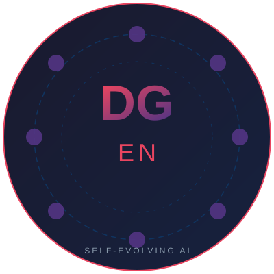

<p align="center">
  
</p>

<h1 align="center">迭进 · DGEN</h1>

<p align="center">
  <b>AI 全域常驻自我迭代进化系统</b><br>
  让 AI 像人一样从错误中学习，越用越聪明
</p>

<p align="center">
  <a href="https://github.com/linsong-dev/diegin-skill/blob/main/LICENSE">
    
  </a>
  
  
  
</p>

---

## 30 秒看懂迭进

迭进是一个 **AI 操作系统级进化层**。它不调任何外部 API，不依赖 GPU，纯 Python 运行。

> 普通 AI：你犯错了 → AI 下次可能还犯同样的错
>
> 带迭进的 AI：你犯错了 → 迭进检测到 → 自动纠错 → 举一反三 → 下次不再犯

### 核心机制

```
用户操作 → [缓急律] 判断优先级
         → [去伪存真] 验证信息真实性
         → [守三·轻量] 扫描最近失败模式
         → 执行操作
            ├─ 成功 → [攻七] 提炼成功模式
            └─ 失败 → [一二不过三] 立改→加固→升级
         → [仲裁器·裁决律] 按优先级裁决
         → [止观门] 封存本轮
         → [守三·深度] 每日复盘
```

---

## 特点

| | |
|:---|:---|
| **八元原则网络** | 守三 · 攻七 · 一二不过三 · 举一反三 · 去伪存真 · 裁决律 · 缓急律 · 止观门 |
| **自主纠错** | 错误自动检测，立改→加固→升级，三错封顶 |
| **自主强化** | 成功模式自动提炼，越用越准 |
| **记忆系统** | 内置 [Mindol](https://github.com/linsong-dev/mindol) 语义记忆引擎，零外部依赖 |
| **全域常驻** | PowerShell 钩子全覆盖，每次操作自动预检 |
| **可插拔规则** | 内置 240+ 规则，支持自定义领域规则包 |
| **零外部依赖** | 纯 Python + numpy，不需要 API Key，不需要 GPU，不需要网络 |
| **不绑定模型** | 可接入任何 AI 模型、任何平台 |

---

## 快速开始

### 环境要求

- Python 3.12+
- Codex 桌面版

### 安装

```powershell
# 1. 克隆仓库
git clone https://github.com/linsong-dev/diegin-skill.git
cd diegin-skill

# 2. 安装依赖
pip install numpy

# 3. 运行测试
python engine/test_all.py

# 4. 注册钩子（将 config/hooks.json 合并到 Codex 的 hooks.json）
```

### 激活

在 Codex 对话中输入：

```
接入迭进
```

或：

```
dgen on
```

---

## 八元原则

| # | 原则 | 方向 | 一句话 |
|:-:|:----|:---:|:-------|
| 0 | **裁决律** | 宪法 | 真伪至上 → 生存优先 → 完形封存 |
| 1 | **守三** | 防守 | 观不足 → 省其因 → 正其行 |
| 2 | **攻七** | 进攻 | 识长处 → 炼精华 → 固其用 |
| 3 | **一二不过三** | 安全阀 | 立改 → 加固 → 升级（三错封顶）|
| 4 | **举一反三** | 扩展 | 举一 → 反三 → 通百 → 回归校验 |
| 5 | **去伪存真** | 硬地板 | 言必有证 → 证必可验 → 验证为真 |
| 6 | **缓急律** | 节奏 | 急务求效 → 缓务求真 → 张弛有度 |
| 7 | **止观门** | 封存 | 事毕封存 → 投入清零 → 不恋战 |

---

## 验证安装

```powershell
cd engine
python test_all.py --verbose
```

预期输出：

```
结果: 16/16 通过 (0 失败)
```

---

## 项目结构

```
diegin/
├── engine/           Python 引擎（八元原则 + Mindol 记忆）
│   ├── call_diegin.py    CLI 入口
│   ├── evo/              八元原则引擎
│   │   ├── rule_engine.py    规则引擎
│   │   ├── arbiter.py        仲裁器（裁决律）
│   │   ├── tracker.py        行为追踪（一二不过三）
│   │   └── pacemaker.py      缓急律调度
│   └── mindol/          Mindol 语义记忆引擎
├── hooks/             PowerShell 钩子（全域常驻）
├── config/            路由配置
├── tests/             测试套件
├── assets/            Logo 等资源
├── sync.ps1           同步脚本
└── deploy/            部署脚本
```

---

## 相关项目

- [Mindol 曼兜](https://github.com/linsong-dev/mindol) — 基于内存的语义记忆引擎（迭进的记忆后端）

---

<p align="center">
  <sub>Built with ❤️ by <a href="https://github.com/linsong-dev">linsong-dev</a></sub>
</p>